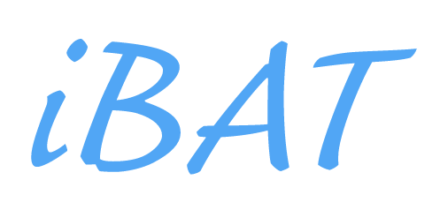
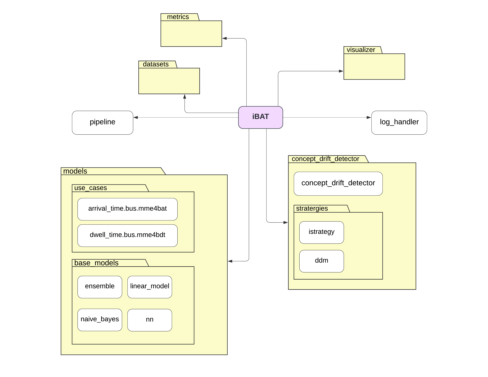

<p align="center">
    
</p>

<p align="center">
    
    
</p>
<p align="center">
    
    
    
    
    
</p>

<p align="center">
    <b>iBAT</b> is a Python framework to enhance the real-time bus arrival time prediction in heterogenous traffic condition by addressing concept drift.
</p>

## Description

<p align="justify">
    This project aims to enhance the precision of real-time bus arrival time prediction models, particularly in the face of heterogeneous traffic conditions and dynamic external factors. The challenge lies in dealing with 'concept drift', which occurs due to evolving conditions like weather fluctuations, traffic variations, industrial impacts, road management changes, and unforeseen accidents. These factors contribute to a continuous shift in the patterns of bus arrival time data. To tackle this issue, we propose an innovative approach that involves the real-time detection of concept drift in the time series data. Once detected, our system quickly adapts to the new patterns by incorporating incremental online learning techniques into the existing state-of-the-art prediction model. This allows our model to efficiently learn from the evolving data within a short timeframe, resulting in more accurate and reliable bus arrival time predictions, ultimately benefiting both commuters and transportation services.
</p>

## Architecture

<p align="center">
    
</p>

## 🛠 Installation

`iBAT` is intended to work with **Python 3.9 and above**. Installation can be done with `pip`:

```sh
pip install ibat
```

There are [wheels available](https://pypi.org/project/ibat/#files) for Linux, MacOS, and Windows. This means you most probably won't have to build iBAT from source.

You can install the latest development version from GitHub as so:

```sh
pip install git+https://github.com/aaivu/ibat --upgrade
pip install git+ssh://git@github.com/aaivu/ibat.git --upgrade  # using SSH
```

[//]: # (This method requires having Cython and Rust installed on your machine.)

## ⚡️ Quickstart

1. To run the pipeline, users can use their datasets or existing datasets from ibat.datasets
```py
from ibat.datasets import BUS_654_DWELL_TIMES, BUS_654_RUNNING_TIMES
```

2. `concept_drift_detector` can be used to detect concept drift. User has a freedom to choose any strategy.
```py
from ibat.concept_drift_detector import CDD
from ibat.concept_drift_detector.strategies import Adwin

# You should define model, ni_x, and ni_y.

cdd = CDD(strategy=Adwin(delta=0.2))
is_detected = cdd.is_concept_drift_detected(model, ni_x, ni_y)
print(is_detected)
```

Output:
```
>>>> True
```

3. `pipeline` can be used to run experiments with the all the steps by simply running one function with some parameters.
```py
from datetime import datetime
from ibat.pipeline import run_exp
from ibat.concept_drift_detector.strategies import DDM


def datetime_from_string(datetime_string: str) -> datetime:
    return datetime.strptime(datetime_string, "%Y-%m-%d")


if __name__ == "__main__":
    cdd_strategy = DDM(
        drift_level=2,
        min_num_instances=2,
    )
    run_exp(
        hist_start=datetime_from_string("2021-10-01"),
        hist_end=datetime_from_string("2022-01-01"),
        stream_start=datetime_from_string("2022-01-01"),
        stream_end=datetime_from_string("2022-11-01"),
        interval_min=60,
        active_strategy=True,
        cdd_strategy=cdd_strategy,
        output_parent_dir="../experiments",
        label="m-xgb-s-xgb_model",
    )
```

## 🤝 Contributors

[//]: # (<a href = "https://github.com/aaivu/ibat/graphs/contributors">)

[//]: # (  )

[//]: # (</a>)

[//]: # ()
[//]: # (Made with [contributors-img]&#40;https://contrib.rocks&#41;.)

1. Kajanan Selvanesan
2. @2
3. @3

[//]: # (## 💬 Citation)

## 📝 License

`iBAT` is free and open-source software licensed under the [Apache License 2.0](https://github.com/aaivu/aaivu-introduction/blob/master/LICENSE).

## Code of Conduct

You can find our [code of conduct document here](https://github.com/aaivu/aaivu-introduction/blob/master/docs/code_of_conduct.md).
